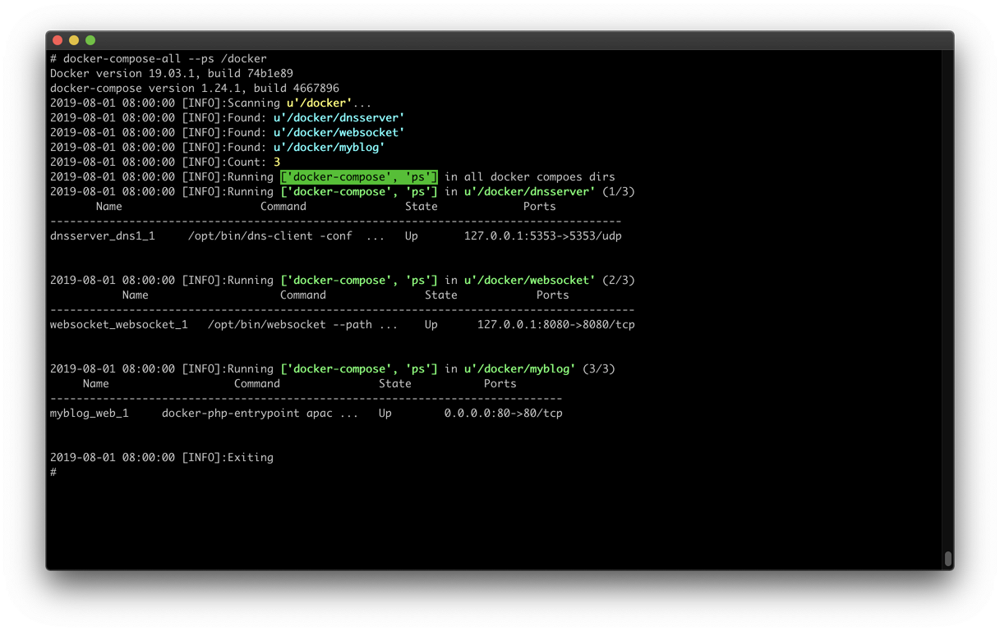

# docker-compose-all

A very simple Docker cluster management tool, recursively search and control all Docker Compose projects in a directory.



## Requirements

- Python >= `3.6`, with `pip` installed
- Docker
- Docker Compose

## Install

```bash
python3 -m pip install -U docker-compose-all
```

## Usage

```console
# docker-compose-all --help
usage: docker_compose_all.py [-h] [--restart | --stop | --down | --build | --up | --ps | --top] [--dokill] [--normi] [--nopull] [--doclean] [-v] DIR

docker-compose-all version 0.2.0
A very simple Docker cluster management tool, recursively search and control all Docker Compose projects in a directory.
https://github.com/Phuker/docker-compose-all

positional arguments:
  DIR            A directory which contains Docker Compose projects

options:
  -h, --help     show this help message and exit
  --restart      Completely rebuild and rerun all. Including the following steps: stop, down, build, up, ps.
  --stop         Stop all containers
  --down         Make all down. Stop and remove containers, networks, images
  --build        Rebuild all
  --up           Make all up
  --ps           Each ps
  --top          List all process
  -v, --verbose  Increase verbosity level (use -vv or more for greater effect)

docker-compose options:
  --dokill       Run "docker-compose kill" instead of "docker-compose stop"
  --normi        Do NOT remove Docker images when running "docker-compose down"
  --nopull       Do NOT pull images when running "docker-compose build"
  --doclean      Clean up before exit, if no error. Remove ALL unused networks, images and build cache. WARN: This may cause data loss.
```

## Documentation

```bash
cat docker_compose_all.py
```

## FAQ


## License

This repo is licensed under the **GNU General Public License v3.0**

