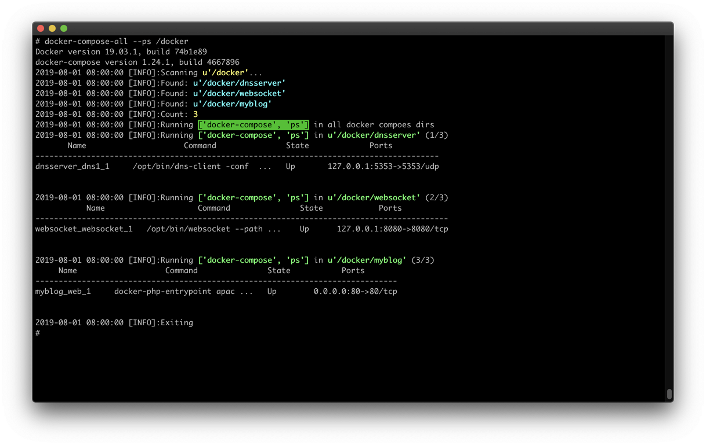

# docker-compose-all

Recursively scan a directory for Docker Compose projects and run `docker compose` in every project found.



## Requirements

- Python 3.10 or later
- Docker
- Docker Compose v2 or later

## Install and run

### Run with uvx (without installation)

```bash
uvx docker-compose-all --help
```

### Run with pipx (without installation)

```bash
pipx run docker-compose-all --help
```

### Install with uv and run

```bash
uv tool install docker-compose-all
docker-compose-all --help
```

### Install with pipx and run

```bash
pipx install docker-compose-all
docker-compose-all --help
```

### Install with pip and run

```bash
pip install docker-compose-all
docker-compose-all --help
```

## Usage

```console
# docker-compose-all --help
usage: docker-compose-all [--dca-scan-dir dir_path] [--dca-verbose] [--dca-cleanup] [-h] [-V] [docker_compose_args ...]

docker-compose-all 0.2.2
Recursively scan a directory for Docker Compose projects and run docker compose in every project found.
https://github.com/Phuker/docker-compose-all

positional arguments:
  docker_compose_args   See below for details

options:
  --dca-scan-dir, --docker-compose-all-scan-dir dir_path
                        Directory to recursively scan for Docker Compose projects, default: '.'
  --dca-verbose, --docker-compose-all-verbose
                        Increase verbosity level
  --dca-cleanup, --docker-compose-all-cleanup
                        Clean up unused Docker networks, images, and build cache before exit, unless an error occurred. WARNING: This may cause data loss.
  -h, --help            Show this help message and exit
  -V, --version         Show version and exit

All arguments are passed through to "docker compose" as-is, so any "docker compose" option and command can be used.
Multiple commands can be chained with the separators ';', '&&', and '||' (quote them to protect them from the shell).
Conditions are evaluated independently for each project, using the exit status of the previous command in that project.

Examples:

  docker-compose-all up -d
  docker-compose-all --progress plain build --pull --no-cache '&&' up -d
```

## License

This repo is licensed under the **GNU General Public License v3.0**
