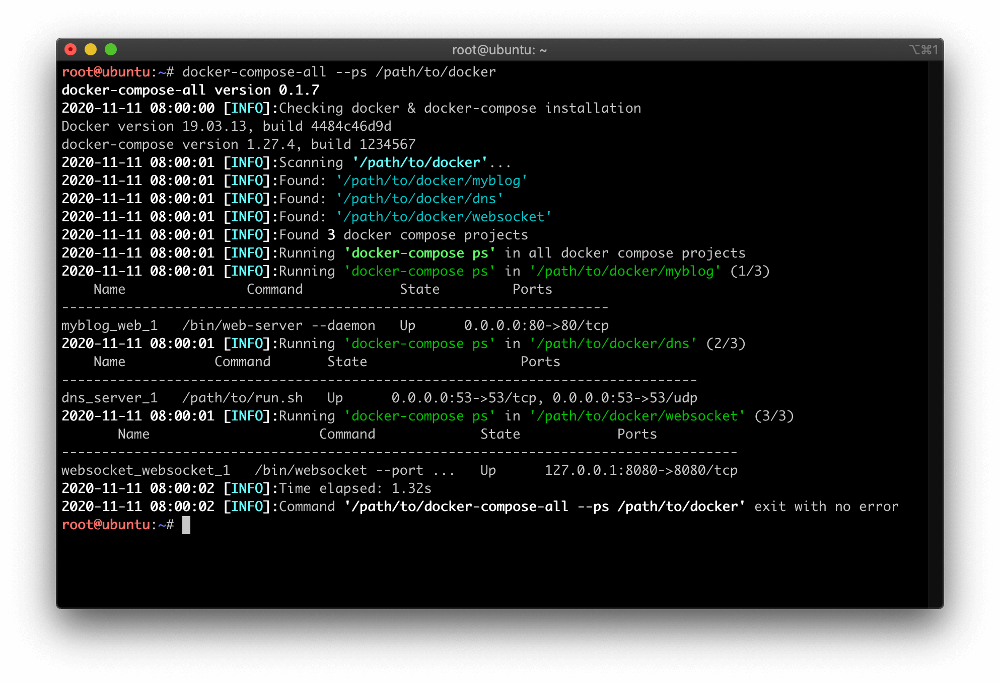

# docker-compose-all

A tool for operating multi docker compose projects   

  

## Requirements
	
	python2
	docker
	docker-compose

## Usage

	# python docker-compose-all.py --help
	usage: docker-compose-all.py [-h]
                                 [--restart | --down | --build | --up | --ps | --top | --stop]
                                 DIR

## Documentation

	cat docker-compose-all.py

## FAQ

## License

this repo is licensed under the **GNU General Public License v3.0**

